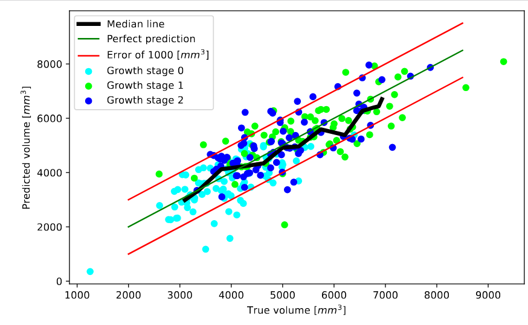

# Overview

This repo contains the code for wheat spike volume prediction on the FIP platform. There are two additional scripts,
one for generating a scaled camera calibration (needed for volume prediction, see below) of the FIP and one for
generating 3d reconstructions of a FIP scene. It also contains all the code used to train models for this task.

# Installation

Simply do `pip install .` in the base folder. You might wanna create a virtual environment first. 
This will install the cpu version of torch and torchvision; if you want to use CUDA, install torch manually as described on the [Torch](https://pytorch.org/) website. The code was tested with torch and CUDA 12.1 under windows.

There are some optional dependencies, which are rarley used i.e. for some of the train experiments, the annotation tool
or the spike pairing evaluation. To install those `pip install .\[sidethings\]`.

In order to run calibration [OpenMVG](https://github.com/openMVG/openMVG) is required. To additionally do 3d reconstruction (pointcloud)
of FIP scans [OpenMVS](https://github.com/cdcseacave/openMVS) is needed. 

# How to use

For volume prediction first create a calibration file of the cameras using fip-calibrate. You will need some properly scaled extrinsics in order to scale the calibration correctly - assets/fip_calibration/extrinsics contains some extrinsics which can be used for this. Note that doing a calibration is not necessary for every scan, calibrations can be reused for different scans as long as the FIP does not significantly change in the meantime.
(If you wanna push your luck you can also use one of the calibrations in assets/poses (not poses_unscaled), probably the latest one, *2024_07_18_14_08_Lot3.json*)

After that use fip-volume together with the generated calibration file in order to infer volume. Especially if using a new calibration, or an
old one for which unsure if correct you can use --output_directory to specify a folder to which all detected, paired spikes should be exported.
If pairing looks very wrong (i.e. each spike ends up with seemingly random other spikes), this is a sign that the calibration is off.

For more details see the help text of the tools. 
If DINOv2 fails to install xformers there might be a warning that xformers is not available.
This is not a large issue - it just makes DINOv2 inference a bit slower, but this anyway is only 10-20% of the total running time.

## How reliable are the volume predictions?

The picture shows the predictions vs the ground truth on the test set. The correlation is 0.80. There tend to be strong outliers and performance is generally worse starting from a volume of roughly 5500-6000. Note that underestimating is not a general occurence - on the validation set e.g. one does not see this. 
The median line was generated by uniformly sampling volume between 3000 and 8000, followed by computing the ground truth median 
and prediction median for the 20 spikes with ground truth volume closest to each sampling point. The question answered is "Given 20
spikes with a volume of roughly x, how will the median true volume (~=x) compare to the median prediction?".
It is somewhat noteworthy that the model never estimated more than 8000 - making it likely that beyond this point the model simply does
not work anymore.

# Where is what

In general things are described in more detail in comments. This just gives a quick overview.

- experiments_volume_models: Contains all experiments for predicting volume from single spikes (at least all more or less successfull ones).
    There is generally a comment indicating what a particular experiment is for. Most experiments save/load caches and/or models from a local folder
    called local_stuff_experiments. This has to be created in the base folder, in order to run models.
    utils_experiment (in shared) contains helper functions to quickly get instances of particular dataset instances. In order to use those 
    functions, paths have to be adapted to the particular environment.
    The usual layout of an experiment is: There are some model names indicating a particular configuration for the model (i.e. train
        regulated transformer on some particular dataset, and so on). There are some if True/False statements that enclose some evaluation
        code (can be enabled disabled in order to evaluate something), usually followed by the actual training code.
    One side note: There is lots and lots of code duplication there; This is intentional in order to be able to change an experiment
        without breaking other experiments. 
- fip_dataset: Contains tools to manage the data of the fip.
    - annotation: Used to annotate the spikes in the images with their label
    - fip_dataset_manager: Tools to operate on full fip scans; e.g. precompute bounding boxes for all FIP scans,
        export single spike images given an annotation file, ...
    - split_dataset and split_tools: Manage the train/val/test split for a dataset
- fip_global: In general everything that operates on full fip scenes, i.e. detecting spikes, pairing spikes,
    calibration, 3d reconstruction or the methods used for training the yolo detection/segmentation models
- image_pairing: The implementation of the spike pairing (respectively bounding box pairing). Also contains
    the evaluation code, and some qualtiative tests for pairing/distance estimation.
- synthetic_fip_render: Methods for generating artificial images/depth maps of spikes. 
- utils: Essentially just methods that are used all over the place.

# Training the final model

- Train a regulated transformer using image_models\experiment_regulated_transformer.py
- Train the ply2volume model using point_models\experiment_rigidinv_direct.py (better use voxelization, but shouldn't matter)
- Train a ply supervised rigidinvariant pointnet with point_models\experiment_rigidinv_indirect_2.py
- Train the ensemble with combined_models\experiment_image_rigidinv_ensemble.py
- Train a distilled version of the regulated transformer with combined_models\experiment_self_distill_ensemble.py

# Preparing new data (in theory)

A general outline for preparing new data is this:
    - Adapt FIPDataset to use whatever layout you used to describe the dataset or recreate the old layout
    - precompute bounding boxes and pairing for all FIP scenes
    - Use the annotation tool to annotate which bounding boxes belong to a particular spike of the dataset
    - Use again FIP dataset to export the cropped annotated spikes into some folder (things like segmentation, padding, and so
        on can be configured, ideally take a look at the code)
    - Use split_tools to generate a new train/test/val split or take over a split from an existing dataset
(In general all those tools are heavily designed towards the existing dataset, so updates to the code are probably necessary)

